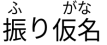

## What is Autovocr?

Autovocr is meant to be an Automatic VobSub OCR tool for subtitles in ***Japanese language***. It aims to be an user-friendly and state of the art tool to convert a .idx/.sub pair to a more easily usable .srt subtitle file.

## Motivation

Efficient open-source OCR tools do exist, and achieve reasonable performance on the general OCR tasks for e.g. documents or street signs. Especially, [Tesseract](https://github.com/tesseract-ocr/tesseract) has achieved largely satisfactory performances for a variety of languages, including Japanese. However, although the Tesseract 4.0's model for English language is trained on [more 4000 fonts](https://github.com/tesseract-ocr/langdata_lstm/blob/master/eng/okfonts.txt), **Japanese OCR model is trained [only on 34 fonts](https://github.com/tesseract-ocr/langdata_lstm/blob/master/eng/okfonts.txt)**.

Besides, it is notable that the font family mostly use for Japanese subtitles in DVDs/BluRays, 丸ゴシック (Maru Gothic) is *not* among the font Tesseract was trained on. It is also to note that Tesseract was *not* trained on italic for Japanese, although they are frequently present in subtitles.

Recently, a PyTorch based open-source OCR implementation has been proposed as [EasyOCR](https://github.com/JaidedAI/EasyOCR). It provides a pretrained OCR model for Japanese that achieves competitive performances. However, the training recipe has not yet been disclosed, as well as which fonts have been used for training. As EasyOCR aims to be an OCR for general use (be it street signs, documents, number plates), it is likely it could be fine-tuned for the special use case of VobSub to srt for Japanese subtitles.

It can also be argued that Japanese subtitles present the particuliar challenge to have furigana (e.g. ), that are *not* supported in the .srt format, and that we would therefore want to remove through the VobSub to srt processing.
